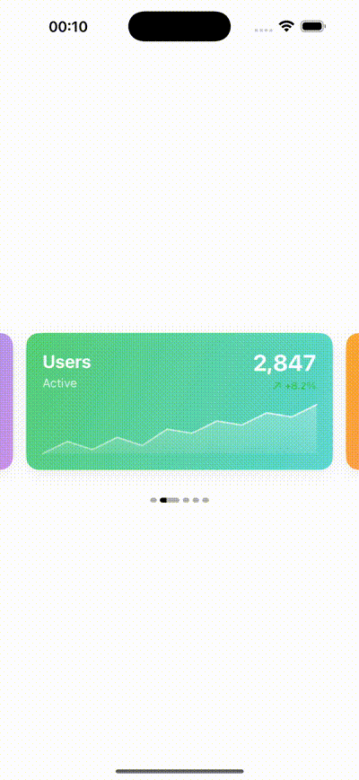

# InfiniteScroll 📱

> Elegant iOS library for infinite scrolling with carousel and indicators

## 🎥 Demo



> 📁 **Assets**: Demo videos and screenshots are available in the [`/assets`](./assets/) folder

## ✨ Features

- 🎠 **Infinite Carousel** - smooth infinite scrolling
- 📊 **Dashboard Cards** - beautiful cards with mini-charts
- 🎯 **Smart Indicators** - intelligent navigation indicators
- 🎨 **Modern UI** - clean and elegant design
- ⚡ **High Performance** - optimized for smooth scrolling

## 🏗️ Architecture

Built with SwiftUI:

- **InfiniteCarouselView** - main carousel component
- **InfiniteCarouselItem** - carousel item
- **InfiniteCarouselIndicator** - navigation indicators
- **DashboardCardView** - dashboard cards
- **MiniChartView** - mini charts for data visualization

## 🚀 Quick Start

1. Open project in Xcode
2. Select simulator or device
3. Press ⌘+R to run

## 📱 Requirements

- iOS 14.0+
- Xcode 12.0+
- Swift 5.0+

## 🎯 Usage

```swift
// Example usage
InfiniteCarouselView(items: yourDataArray) { item in
    YourCustomView(item: item)
}
```

---

*Made with ❤️ for iOS developers*